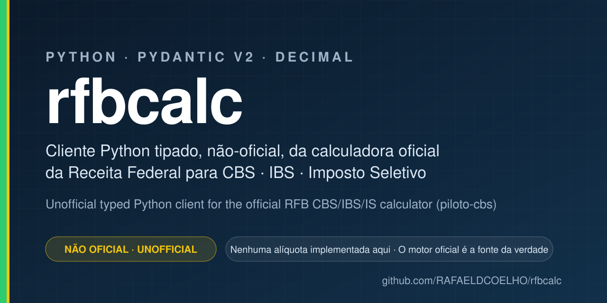

# rfbcalc

[](https://github.com/RAFAELDCOELHO/rfbcalc/actions/workflows/ci.yml)
[](LICENSE)
[](https://www.python.org/)

<p align="center">
  
</p>

Typed Python client for the **official** Receita Federal do Brasil calculator for
**CBS**, **IBS** and **Imposto Seletivo** (Reforma Tributária do Consumo, LC 214/2025).

> ⚠️ **AVISO / DISCLAIMER**
>
> **PT-BR** — Este projeto **não é da Receita Federal** e não é oficial. Ele apenas
> transporta dados para a calculadora oficial e devolve a resposta dela. **Nenhuma
> alíquota, base de cálculo ou regra da LC 214/2025 é implementada aqui.** O motor
> oficial é a única fonte da verdade. O motor está em **VERSÃO BETA** (ambiente
> piloto) e seus resultados não substituem orientação fiscal ou jurídica.
>
> **EN** — This project is **not** the Receita Federal and is not official. It only
> transports data to the official calculator and returns its answer. **No rate,
> calculation base or LC 214/2025 rule is implemented here.** The official engine is
> the single source of truth. That engine is in **BETA** (pilot environment) and its
> results are not tax or legal advice.

---

## PT-BR

### O que é

`rfbcalc` é um cliente Python **não-oficial** e tipado (Pydantic v2) para a
[Calculadora de Tributos sobre o Consumo](https://piloto-cbs.tributos.gov.br/servico/calculadora-consumo/)
da Receita Federal.

O que a biblioteca faz:

- monta o payload JSON com os **nomes de campo oficiais**;
- envia ao motor oficial (online ou offline);
- devolve a resposta tipada, com valores monetários em `Decimal` (sem `float`).

O que a biblioteca **não** faz: calcular tributo. Todo número vem do motor oficial.

### Instalação

```bash
pip install rfbcalc          # a partir do PyPI (quando publicado)
pip install -e '.[dev]'      # a partir do repositório
```

Requer Python 3.11+.

### Uso

```python
from rfbcalc import Calculator

with Calculator() as calc:
    # Base de cálculo de CBS/IBS - POST /calculadora/base-calculo/cbs-ibs-mercadorias
    base = calc.base_calculo_cbs_ibs(
        anoFatoGerador=2026,
        valorBem="1000.00",
        icms="180.00",
        pis="16.50",
        cofins="76.00",
        frete="50.00",
        descontoIncondicional="30.00",
    )
    print(base.baseCalculo)          # Decimal('747.50'), calculado pelo motor oficial

    # Base de cálculo do Imposto Seletivo - POST /calculadora/base-calculo/is-mercadorias
    calc.base_calculo_imposto_seletivo(anoFatoGerador=2027, valorBem="1000.00", icms="180.00")

    # Cálculo completo da operação - POST /calculadora/regime-geral
    resultado = calc.regime_geral({
        "id": "op-001",
        "versao": "1.0.0",
        "dhFatoGerador": "2026-01-15T10:00:00-03:00",
        "municipio": 3550308,                       # São Paulo/SP
        "itens": [{
            "numero": 1,
            "cst": "000",
            "cClassTrib": "000001",
            "baseCalculo": "1000.00",
        }],
    })
    print(resultado.vBC, resultado.vIBS, resultado.vCBS, resultado.vIS)
```

Os nomes dos campos são **idênticos aos da API oficial** (camelCase, em português).
Isso é proposital: qualquer atributo pode ser conferido diretamente no
[OpenAPI oficial](https://piloto-cbs.tributos.gov.br/servico/calculadora-consumo/api/api-docs),
sem uma camada de tradução que possa introduzir erro.

Valores monetários são sempre `Decimal`. A resposta é desserializada com
`parse_float=Decimal`, então nenhum centavo se perde num `float`.

### Erros

Erros do motor oficial (RFC 7807 `problem+json`) viram `RfbCalcError`:

```python
from rfbcalc import Calculator, RfbCalcError

try:
    with Calculator() as calc:
        calc.base_calculo_cbs_ibs(anoFatoGerador=1800, valorBem="100.00")
except RfbCalcError as exc:
    print(exc.status_code)   # 400
    print(exc.problem)       # payload completo devolvido pela Receita
```

### CLI

```bash
rfbcalc versao
rfbcalc base-calculo-cbs-ibs anoFatoGerador=2026 valorBem=1000.00 icms=180.00
rfbcalc base-calculo-is anoFatoGerador=2027 valorBem=1000.00 icms=180.00
rfbcalc regime-geral operacao.json          # use '-' para stdin
rfbcalc demo
```

Códigos de saída: `0` sucesso, `1` erro do motor oficial ou de rede, `2` entrada inválida.

### Demonstração

```bash
make demo
```

Um comando: cria o virtualenv, instala o pacote, chama o **motor oficial ao vivo** e
compara cada valor, **até o centavo**, com um resultado oficial gravado em
[`src/rfbcalc/fixtures/official_responses.json`](src/rfbcalc/fixtures/official_responses.json).

Esse arquivo **não foi escrito à mão**: ele é gravado verbatim do motor oficial por
[`scripts/record_fixtures.py`](scripts/record_fixtures.py) (`make record-fixtures`) e
guarda a versão do motor e da base de referência usadas. Se a Receita mudar um valor,
o `make demo` falha — que é exatamente o comportamento desejado.

### Motor offline

O motor online é o padrão. A Receita também publica uma
[calculadora offline oficial](https://piloto-cbs.tributos.gov.br/servico/calculadora-consumo/calculadora/calculadora-offline)
que expõe **a mesma API** em `http://localhost:8080/api`.

```bash
make demo-offline       # baixa, sobe o motor oficial offline, roda a demo e derruba no fim
make offline-start      # apenas sobe o motor
make offline-stop
```

Requer **Docker**. O pacote oficial (`calculadora.zip`) não contém um `.jar` solto: ele
traz `calculadora.tar.gz`, uma imagem de contêiner com o `api-regime-geral.jar` dentro.
Por isso o `make offline-start` segue exatamente o caminho oficial documentado pela
Receita (`linux/1-instalar.sh` e `linux/2-executar.sh` do próprio pacote):

```bash
docker import ./calculadora.tar.gz calculadora-image
docker run -t -i --rm -p 8080:8080 -p 8081:8081 -p 80:80 \
  -w /calculadora --name calculadora-container calculadora-image bash start.sh
```

O `make offline-start` publica apenas 8080 e 8081; a porta 80 (portal web) exige
privilégios que a demo não precisa. O download é de ~250 MB e vem do endereço
publicado pela própria Receita.

Em Python, basta apontar o cliente para o motor local:

```python
from rfbcalc import Calculator

with Calculator.offline() as calc:               # http://localhost:8080/api
    calc.base_calculo_cbs_ibs(anoFatoGerador=2026, valorBem="1000.00")
```

Os motores online e offline foram verificados lado a lado: para os casos da demo eles
devolvem **exatamente os mesmos valores**.

### Desenvolvimento

```bash
make check         # ruff + mypy + pytest
make test          # testes unitários (sem rede)
make test-live     # testes contra o motor oficial de verdade
make help
```

Os testes de CI não acessam a rede: as respostas oficiais são reproduzidas com
`respx` a partir do fixture gravado. Assim o CI não depende de um serviço do governo
estar no ar, mas os números continuam sendo os oficiais.

---

## English

### What it is

`rfbcalc` is an **unofficial**, typed (Pydantic v2) Python client for the Receita
Federal do Brasil [consumption-tax calculator](https://piloto-cbs.tributos.gov.br/servico/calculadora-consumo/)
covering CBS, IBS and Imposto Seletivo under LC 214/2025.

The library builds the JSON payload using the **official field names**, sends it to
the official engine (online or offline), and returns a typed response with monetary
values as `Decimal`. It computes no tax of its own — every number comes from the
official engine.

### Install

```bash
pip install rfbcalc          # from PyPI (once published)
pip install -e '.[dev]'      # from a clone of this repository
```

Python 3.11+.

### Quickstart

```python
from rfbcalc import Calculator

with Calculator() as calc:
    base = calc.base_calculo_cbs_ibs(
        anoFatoGerador=2026, valorBem="1000.00",
        icms="180.00", pis="16.50", cofins="76.00",
    )
    print(base.baseCalculo)   # Decimal, straight from the official engine
```

Field names mirror the official API verbatim (camelCase, Portuguese) so every
attribute can be cross-checked against the official OpenAPI document. There is no
translation layer that could silently introduce an error.

### Covered endpoints

| Method | Path | Client |
| --- | --- | --- |
| POST | `/calculadora/base-calculo/cbs-ibs-mercadorias` | `base_calculo_cbs_ibs()` |
| POST | `/calculadora/base-calculo/is-mercadorias` | `base_calculo_imposto_seletivo()` |
| POST | `/calculadora/regime-geral` | `regime_geral()` |
| GET | `/calculadora/dados-abertos/versao` | `versao()` |

Base URL: `https://piloto-cbs.tributos.gov.br/servico/calculadora-consumo/api`
(no API key required as of 2026-09).

Responses use `extra="allow"`, so fields added by the engine — which is under active
development — reach the caller instead of being dropped.

### Demo

```bash
make demo
```

Sets up a virtualenv, installs the package, calls the **live official engine** and
asserts every value matches a **recorded official result to the centavo**. The
expected numbers are recorded verbatim from the engine by `make record-fixtures`,
never written by hand.

### Offline engine

The Receita also publishes an official **offline** calculator exposing the same API on
`http://localhost:8080/api`.

```bash
make demo-offline    # downloads, starts the official offline engine, runs the demo, tears it down
```

Requires **Docker**. The official package contains no loose `.jar` — it ships
`calculadora.tar.gz`, a container image with `api-regime-geral.jar` inside — so
`offline-start` follows the Receita's own documented route (`docker import` +
`docker run … bash start.sh`, per `linux/1-instalar.sh` and `linux/2-executar.sh` in the
official package).

In Python, `Calculator.offline()` targets `http://localhost:8080/api`.

Both engines were checked side by side: for the demo cases they return **identical
values**.

### Development

```bash
make check       # ruff + mypy + pytest
make test-live   # exercise the real official engine
```

## Citation

See [CITATION.cff](CITATION.cff).

## License

MIT — see [LICENSE](LICENSE). The official calculator itself belongs to the
Receita Federal do Brasil and is governed by its own terms.
